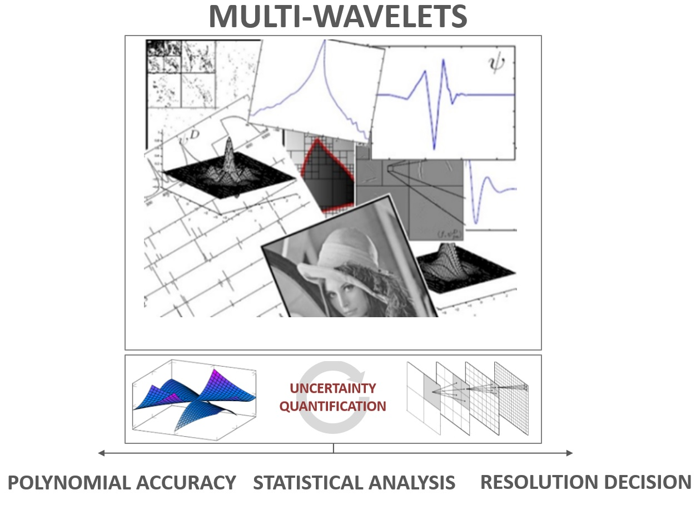

### Approach
Multi-Wavelets are augmented forms of wavelets which allow precise, bi-directional, multiscale analysis. Construction of Multi-Wavelets on a mother basis function yields sets of inner bases that have local and nonoverlapping supports at each scale level, but which are globally nested across all scale levels. The power of such multiscale bases lies in their ability to decompose and reconstruct the scales of a given signal relevant to physical and/or statistical modelling data. Although popular in signal and image processing applications, the use of wavelets for flood forecasting is still in its infancy. The idea behind SEAMLESS-WAVE is exploit the versatile properties of Multi-Wavelets, by capitalising on their simultaneous ability to:
- Unambiguously detect and separate localised dominant flow and terrain features on locally nested adaptive grids, thereby providing a tool for intrinsic resolution decision-making; 
- Be adapted as local basis functions, which allows to increase polynomial accuracy in local storage and evolution of the modelling data; 
- Perform multi-scale analysis for accessing, upscaling and downscaling the modelling information across various spectrum of resolution involved in the adaptive grid; 
- Further apply/expand the deterministic model formulation for informing on the statistics of uncertainty propagations due to uncertain inputs in an entirely compatible framework. 

[back](./)
