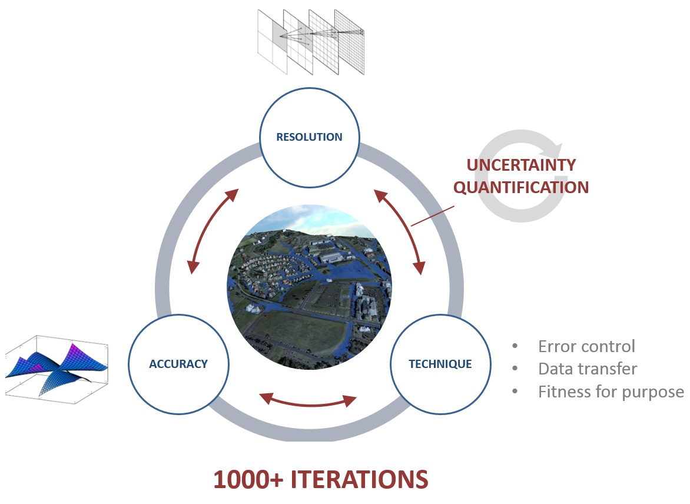

### 1. Rationale
The need to better forecast and model flooding is of strategic importance to society and science. Policy-makers continue to desire more accurate and comprehensive flood warning maps to issue for public protection against flood events. Hydraulic consultancy and software industry firms still aspire to achieve significantly greater intelligence, reliability, coverage and functionality in their next-generation of hydraulic models, which can particularly obviate manual labour for excessive user iterations in building and running flood models, better control scaling effects due to inter-regional dependencies and more efficiently forecast uncertainty propagation. Aligned with these needs, scientists and engineers across many research communities still seek to develop a modelling framework that is “intelligent” and “holistic”, in the sense of being:
- Adaptable (able to embed and self-select a cascade of scales) 
- Reliable and efficient (to ensure a high-quality answer, in as rapid a time as possible)
- Versatile (applicable to solve a wide/compound range of physical scales and/or domains)
- Comprehensive (inform on numerical-model error and/or physical uncertainty propagation)

[back](./)
